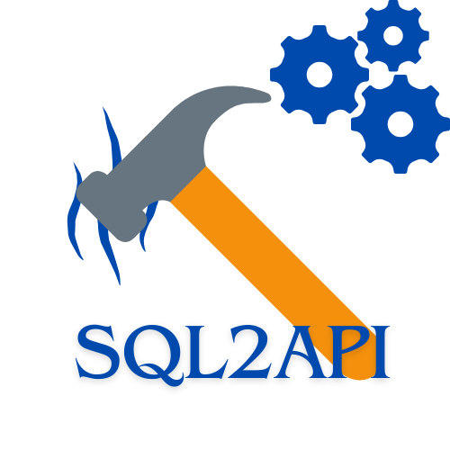

### SQL2API

Sometimes, you need to saw a table with a hammer..
Do it with elegance and robustness!

**SQL2API** is a ridiculously fast and easy backend framework where, with just SQL, you can spin up a robust, scalable API server ready for production.

### The key features are:

- Fast: Very high performance, of course, its builtin in golang
- Fast to Code: Do magic using only SQL
- Ridiculously Easy: No need to be a programmer—if you use SQL daily, you’re ready to build complex APIs.
- Robust: Integration with the principal DataBases - Mysql, Sqlite, Postgresql

### How to use:

    Configure a few parameters in config.yaml.
    Write SQL to create your tables in the Tables section.
    Write SQL to handle API logic in the Models section.

And that’s it—production-ready!
